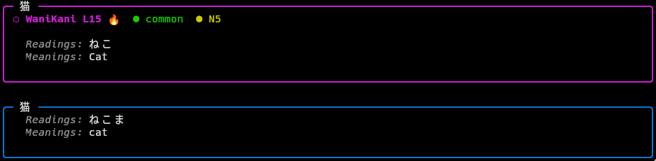
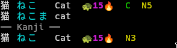

# jisho

A Japanese dictionary CLI powered by [jisho.org](https://jisho.org), with
optional enrichment from WaniKani and Anki.




## Features

- Vocabulary and kanji lookup via the Jisho API
- WaniKani integration — shows level, highlights burned items
- Anki integration — marks words already in your deck
- JLPT level and common-word indicators
- Unknown kanji detection (kanji you haven't studied yet)
- Three output formats: `rich` (panels), `compact` (one line), `json`
- Light and dark terminal theme support

## Installation

### NixOS / home-manager

Import the module and enable it in your home config:

```nix
imports = [ ./jisho ];

programs.jisho = {
  enable = true;
  anki.fields = {
    "My Note Type" = "Word Field";
  };
};
```

The module writes `~/.config/jisho/config.json` at build time and
installs the `jisho` binary. Apply with `nrs`.

### Other systems

Ensure Python 3 is available with `requests` and `rich`, then run:

```bash
jisho init-config   # write default config to ~/.config/jisho/config.json
```

Edit the config file to suit your setup.

## Usage

```
jisho <word> [options]
```

| Flag | Description |
|------|-------------|
| `--format` | Output format: `rich` (default), `compact`, `json` |
| `--verbose` | Show all kanji, not just unknown ones |
| `--limit N` | Max vocabulary results to show (default: 5) |

### Subcommands

```
jisho init-config [--force]
```

Writes a default config file for easy editing. Aborts if the config is
managed by Nix home-manager (symlinked from the Nix store).

## WaniKani integration

Place your API token in `~/.config/wanikani/token`, or export it as
`WANIKANI_API_TOKEN`. Subject data (vocabulary and kanji with levels and
burn status) is fetched from the WaniKani v2 API and cached locally for
7 days. The cache is refreshed automatically on next run when it expires.

## Anki integration

Requires the [AnkiConnect](https://ankiweb.net/shared/info/2055492159)
add-on (id: **2055492159**) installed in Anki. Configure which note type
and field contain your vocabulary words:

```json
{
  "anki": {
    "fields": {
      "My Note Type": "Word Field"
    }
  }
}
```

Multiple note types are supported. Words are cached locally after the
first successful fetch, so **Anki only needs to be running occasionally**
to keep the cache fresh. If Anki is not running, jisho falls back to the
cache and shows a warning if it is stale (older than 7 days by default).

## Configuration

The config file lives at `~/.config/jisho/config.json`. On NixOS it is
generated by the home-manager module; on other systems use `init-config`.

All keys are optional — omitted keys use their defaults.

```json
{
  "format": "rich",
  "colors": {
    "title": "default",
    "badge": {
      "anki": "bold green",
      "wanikani": "bold magenta",
      "common": "green",
      "jlpt": "yellow",
      "warning": "yellow",
      "danger": "red"
    },
    "border": {
      "anki": "green",
      "wanikani": "magenta",
      "default": "blue"
    },
    "text": {
      "label": "italic dim",
      "value": "default",
      "reading": "cyan"
    }
  },
  "badges": {
    "anki": "★ Anki",
    "wkPrefix": "⬡ WaniKani L",
    "burned": " 🔥",
    "common": "● common",
    "jlptPrefix": "● ",
    "notInWk": "⚠ not in WaniKani",
    "notJouyou": "⚠ not jouyou"
  },
  "anki": {
    "fields": {}
  },
  "cache": {
    "wkTtl": 604800,
    "ankiStaleTtl": 604800
  },
  "wanikani": {
    "enable": false
  }
}
```

Color values are [Rich style strings](https://rich.readthedocs.io/en/stable/style.html)
(`"bold green"`, `"cyan"`, `"#ff0000"`, etc.).

### Light mode

On NixOS, set `programs.jisho.theme = "light"` to switch to a
light-terminal-friendly palette. On other systems, adjust `colors.text.reading`,
`colors.badge.warning`, and `colors.badge.jlpt` manually (e.g. `"blue"`,
`"dark_orange"`, `"dark_orange"`).

## Data sources

| Source | Data | Cache |
|--------|------|-------|
| [jisho.org](https://jisho.org/api/v1/search/words) | Vocabulary search | None (live) |
| [kanjiapi.dev](https://kanjiapi.dev) | Kanji readings, jouyou grade | None (live) |
| [WaniKani v2 API](https://docs.api.wanikani.com) | Levels, burn status | `~/.cache/jisho/wanikani.json` |
| AnkiConnect (local) | Words in your deck | `~/.cache/jisho/anki_words.json` |
